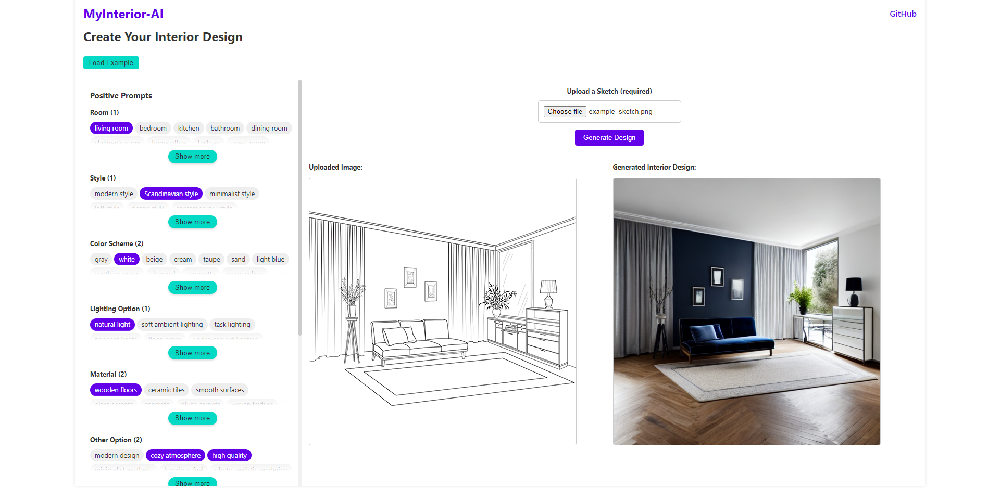

# MyInterior-AI

This project demonstrates **creating interior designs** from a user-provided **sketch** image. It uses a **React** frontend for prompt selection and image upload, and a **FastAPI** backend that calls [Replicate’s](https://replicate.com/) **ControlNet** model. The sketch is interpreted as “canny edges,” then combined with the user’s prompt (including style, color, lighting, etc.) to generate a brand-new interior design concept. **ControlNet** deep learning model can steer an existing diffusion model (Stable Diffusion) based on an edge map.



---

## 1. Quick Start

1. **Register on [replicate.com](https://replicate.com/)**  
   - Set up billing. The model usage typically costs **\$0.0022** per image generation (price depends on [replicate.com](https://replicate.com/)).

2. **Edit [`.env`](.env) File in the project root folder**  
   Insert your **Replicate API token** here:
   ```
   REPLICATE_API_TOKEN=your_replicate_api_token
   ```
3. **Run with Docker**  
   In the project root, run:
   ```
   docker-compose up --build
   ```
   This will:
   - Build and launch the **backend** (FastAPI) on port **8000**.  
   - Build and launch the **frontend** (React) on port **3000**.  
   - Connect them together in one environment.

4. **Access the App**  
   [http://localhost:3000](http://localhost:3000)
---

## 2. Project Description – Interior Design from Sketch

1. **Upload Sketch**: You provide a **drawn** or **scanned** interior outline – for instance, a rough floorplan or a simple room shape.  
2. **Pick Prompts**: Choose **style** (e.g., “Scandinavian”, “loft”), **colors** (e.g., “white”, “navy blue”), **lighting** types, etc. You can also add negative prompts (unwanted features like “blurry” or “pixelated”).  
3. **Generate**: The **backend** calls replicate.com’s **ControlNet** model, sending your **sketch** (converted to canny edges) and your textual prompts.  
4. **Results**: You’ll see a newly generated “interior design” concept that tries to respect your sketch’s shape and your chosen style or color scheme.

---

## 3. Deep Learning Model: ControlNet

### Model Summary

**ControlNet** model on [replicate.com](https://replicate.com/) apply “canny edge” conditioning to a Stable Diffusion generator. The controlling idea is:
- Convert your sketch to an edge map.  
- Condition the diffusion model on these edges.  
- Combine with your prompts (e.g., “Scandinavian living room, bright space, wooden floors”).

**Key features**:
- **structure** = `"canny"` for this build.  
- **image_resolution** = `512`  
- **prompt** = `"a photo of a " + user’s positive prompt`  
- **negative_prompt** = user’s negative prompt  
- **scheduler** = `"DDIM"`  
- **steps** = `30`  
- **scale** = `10`  
- **seed** = `20`  

**Expected cost**: ~\$0.0022 per image (replicate.com pricing).

### Model Description (Reference)
ControlNet itself is described in the paper:

> **Adding Conditional Control to Text-to-Image Diffusion Models** by Lvmin Zhang et al.  
> [arXiv:2302.05543](https://arxiv.org/abs/2302.05543), [GitHub Repo](https://github.com/lllyasviel/ControlNet)

This approach enriches stable diffusion by adding an extra “control path” to handle structural information (edges, scribbles, pose, etc.).

---

## 4. Other Sub-Readmes

- **[backend/README.md](./backend/README.md)** – Explains how the FastAPI service works.  
- **[frontend/README.md](./frontend/README.md)** – Explains how the React app is structured.

---